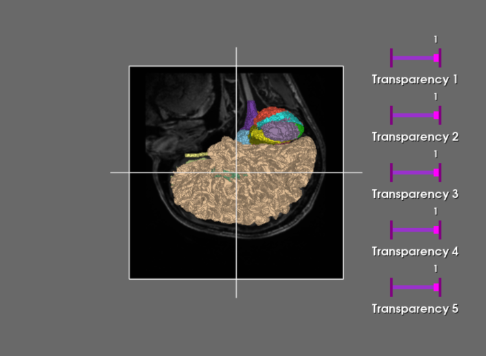
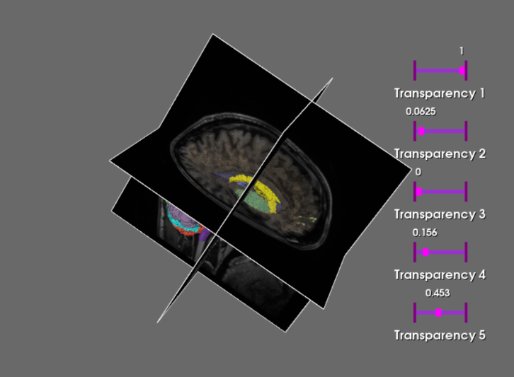

# Brain Atlas 3D Visualizer 

## Overview

This project is an interactive 3D visualization tool for medical imaging data, specifically designed to explore brain anatomy. Using the SPL/NAC Brain Atlas, the application renders raw MRI volumes alongside segmented anatomical structures. The tool provides an intuitive interface to inspect internal brain structures through orthogonal planes and 3D surface reconstruction with real-time transparency control.

# Key Features
- Orthogonal Slicing: Interactive X, Y, and Z plane widgets for raw T1 MRI data inspection.
- 3D Surface Reconstruction: Generates 3D volumes of brain structures from segmentation labels using the DiscreteMarchingCubes algorithm.
- Interactive Transparency: Custom UI sliders to adjust the opacity of specific brain segments in real-time.
- Custom Lookup Tables: Precise color mapping based on professional anatomical color tables (.ctbl).

# Dataset Information

The project utilizes the SPL/NAC Brain Atlas from The Open Anatomy Project.
- Source: Based on MRI scans of a healthy 42-year-old male.
- Data: https://www.openanatomy.org/atlas-pages/atlas-spl-nac-brain.html

# Visualizations

1. Multi-planar Reconstruction (MPR) & 3D Segmentation

The application overlays segmented anatomical structures as 3D meshes on top of monochromatic raw MRI slices.

2. Real-time Transparency Control

Users can manipulate sliders to peel away layers of the brain, allowing for the inspection of deep-seated structures.

# Technical Implementation (VTK Pipeline)

This project demonstrates advanced use of the Visualization Toolkit (VTK):
- vtkImagePlaneWidget: For interactive slicing of raw volumes.
- vtkDiscreteMarchingCubes: For generating manifold meshes from labeled voxels.
- vtkThreshold & vtkGeometryFilter: For isolating specific anatomical regions.
- vtkSliderWidget: For building the interactive GUI directly within the 3D render window.